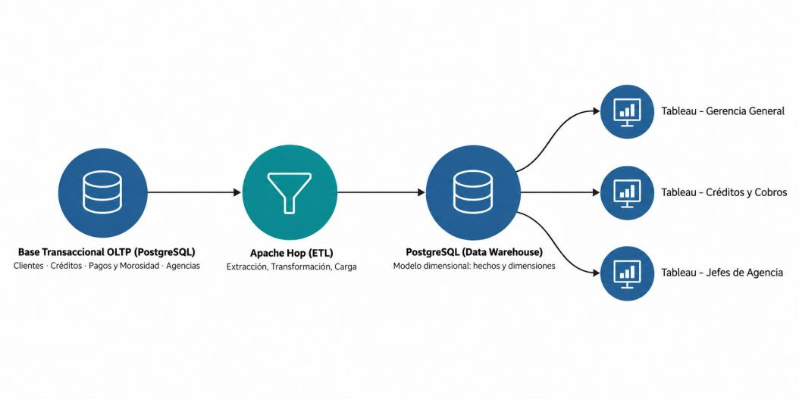

# Proyecto 1 — Solución de Inteligencia de Negocios para CoopeBI

**TI6900 Inteligencia de Negocios** · Lic. Michael Sánchez Soto · II Semestre 2026
Escuela de Administración de Tecnología de la Información — Tecnológico de Costa Rica, Campus Central Cartago

**Grupo 6** · Tema 6: Cooperativa o entidad financiera

| Hito | Fecha |
|---|---|
| Entrega final | 05/10/2026, 23:45 |
| Presentación oral | 13/10/2026 (máx. 15 min., todos exponen) |

---

## Descripción

CoopeBI es una cooperativa de ahorro y crédito con cobertura nacional (créditos personales, hipotecarios, comerciales y prendarios en varias agencias regionales). Hoy sus reportes son estáticos y tardan días en consolidarse, lo que impide cruzar morosidad, regiones, canales de pago y rentabilidad.

Este proyecto diseña e implementa una solución de BI que permite analizar de forma multidimensional la **cartera de crédito, los pagos, la morosidad y los ingresos** para apoyar decisiones estratégicas, tácticas y operativas.

## Arquitectura



| Etapa | Herramienta | Rol |
|---|---|---|
| Fuente transaccional (OLTP) | PostgreSQL | Clientes, créditos, pagos y morosidad, agencias |
| ETL | Apache Hop | Extracción, transformación y carga hacia el modelo dimensional |
| Data Warehouse | PostgreSQL | Modelo dimensional (hechos y dimensiones) |
| Capa analítica | Tableau | Vistas para Gerencia General, Créditos y Cobros, y Jefes de Agencia |

La justificación de cada herramienta está en [`docs/fase1`](docs/fase1/Fase1_Requerimientos_y_Arquitectura.pdf).

## Preguntas de negocio

| ID | Pregunta | Medidas | Variables de análisis |
|---|---|---|---|
| BQ-01 | ¿Qué productos de crédito, agencias y segmentos concentran los mayores montos colocados y cantidad de operaciones? | Monto total colocado, cantidad de operaciones | Producto, agencia, segmento, periodo |
| BQ-02 | ¿Cómo se comportan el saldo pendiente y la morosidad según producto, rango de atraso, región y periodo? | Saldo pendiente de cartera, índice de morosidad | Producto, rango de atraso, región, periodo |
| BQ-03 | ¿Qué canales y tipos de crédito registran mayores montos de pago y recuperación por periodo? | Monto de recuperación, monto total pagado | Canal de pago, tipo de crédito, periodo |
| BQ-04 | ¿Qué productos y segmentos generan mayores ingresos por intereses y comisiones? | Ingresos por intereses y comisiones | Producto, segmento, periodo |
| BQ-05 *(adicional)* | ¿Cómo varía el monto promedio de los créditos otorgados según producto, segmento, agencia y periodo? | Promedio de crédito | Producto, segmento, agencia, periodo |

## Estructura del repositorio

```
TI6900-Proyecto1-CoopeBI/
├── README.md
├── data/
│   ├── raw/                 # Datos fuente (CSV / exportaciones del OLTP)
│   └── processed/           # Datos intermedios o de validación
├── sql/
│   ├── oltp/                # DDL y carga de la base transaccional
│   ├── dw/                  # DDL del Data Warehouse (dimensiones y hechos)
│   └── consultas/           # Consultas de validación y de respuesta a las BQ
├── etl/
│   └── apache-hop/
│       ├── pipelines/       # Transformaciones (.hpl)
│       └── workflows/       # Orquestación (.hwf)
├── analytics/
│   └── tableau/             # Libros de Tableau (.twb / .twbx)
├── scripts/                 # Scripts de apoyo (generación de datos, utilidades)
└── docs/
    ├── fase1/               # Requerimientos y arquitectura (Fase 1)
    ├── informe/             # Plantilla y versión final del informe
    ├── presentacion/        # Diapositivas de la exposición
    └── img/                 # Diagramas e imágenes
```

Cada carpeta tiene su propio `README.md` con lo que debe ir ahí y la convención de nombres.

## Cómo empezar

1. Clonar el repositorio:
   ```bash
   git clone <URL-del-repositorio>
   cd TI6900-Proyecto1-CoopeBI
   ```
2. Instalar las herramientas: [PostgreSQL](https://www.postgresql.org/download/), [Apache Hop](https://hop.apache.org/download/) y [Tableau Desktop / Public](https://www.tableau.com/products/public).
3. Crear las bases con los scripts de `sql/oltp` y `sql/dw` (en orden numérico).
4. Abrir `etl/apache-hop` como proyecto en Apache Hop y ejecutar el workflow principal.
5. Abrir el libro de `analytics/tableau` y apuntar la conexión al Data Warehouse local.

## Forma de trabajo

- Trabajar en una rama por tarea: `fase<N>/<descripcion-corta>` (ej. `fase2/modelo-dimensional`).
- Abrir un Pull Request hacia `main`; otra persona del grupo lo revisa antes de fusionar.
- Mensajes de commit en español y en imperativo: `Agrega DDL de dim_agencia`.
- No subir credenciales ni archivos de conexión con contraseñas (ver `.gitignore`).

## Integrantes

| Nombre | Carné |
|---|---|
| Allan Andrey Jiménez Badilla | 2024080466 |
| Sara María Segura González | 2023097391 |
| Eliam Vives Vallejos | 2023172541 |
| Sergio Mena Campos | 2023395826|
